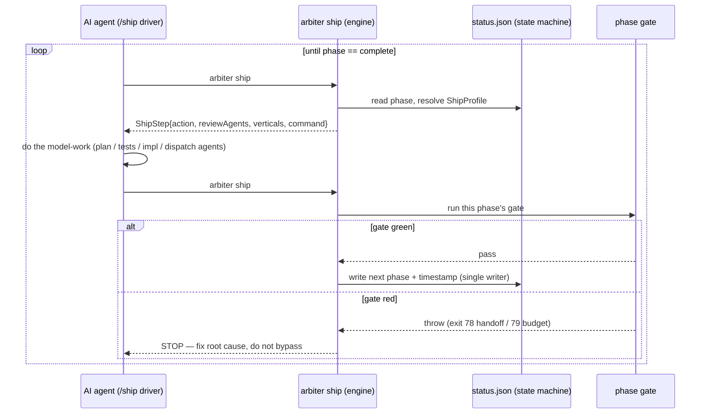

# Arbiter — Architecture (arc42)

A GOLD, enterprise-grade architecture description of **arbiter** following the
[arc42](https://arc42.org/) template. It is populated from the **reality of the code**, not
aspirations — where arbiter is inconsistent, drifting, or carries pruned scaffolding, §11 says so
plainly. The dynamic agent-orchestration rules (§6) are the centre of gravity: they are the value
that a simplified re-telling of arbiter does not capture.

> Companion docs: [`c4-model.md`](c4-model.md) (the three C4 diagrams), [`adr-index.md`](adr-index.md)
> (the ADR catalogue + gaps). Pre-existing consolidated reference:
> [`docs/internal/architecture/ARCHITECTURE.md`](../internal/architecture/ARCHITECTURE.md).

**Contents**

1. [Introduction & Goals](#1-introduction--goals)
2. [Architecture Constraints](#2-architecture-constraints)
3. [Context & Scope](#3-context--scope)
4. [Solution Strategy](#4-solution-strategy)
5. [Building Block View](#5-building-block-view)
6. [Runtime View](#6-runtime-view) — the dynamic orchestration jewels
7. [Deployment View](#7-deployment-view)
8. [Crosscutting Concepts](#8-crosscutting-concepts)
9. [Architecture Decisions](#9-architecture-decisions)
10. [Quality Requirements](#10-quality-requirements)
11. [Risks & Technical Debt](#11-risks--technical-debt) — the honest section
12. [Glossary](#12-glossary)

---

## 1. Introduction & Goals

Arbiter is a **governance installer for AI-assisted software development, with an optional
orchestration layer** (`package.json` description). It is an `npx` CLI (`@arbiter/cli`, Apache-2.0,
Node ≥ 22) that writes a complete, self-consistent governance stack into a target repository — a
canonical `AGENTS.md`, per-tool pointer files, enforcement hooks, a tiered quality gate, and a
matching CI pipeline — all as ordinary version-controlled files.

Its distinguishing thesis: **"AI governance that installs itself — and can't be faked."** Coding
agents are fluent at claiming work is done; arbiter makes "done means tested" mechanical. A
completion claim with no correlated evidence (a test that failed before the fix and passes after,
tied to the current branch and SHA) is rejected like a failing gate.

### 1.1 Top three requirements (the "three primitives")

| #   | Primitive                       | What it guarantees                                                                                                                                                       |
| --- | ------------------------------- | ------------------------------------------------------------------------------------------------------------------------------------------------------------------------ |
| 1   | **Self-installing governance**  | One `arbiter init` emits a canonical `AGENTS.md` + thin per-tool overlays + hooks + gates + CI, idempotently re-runnable, deletable with `rm`.                           |
| 2   | **Gate-blocked task lifecycle** | Work moves through a fixed, machine-checked phase sequence (plan → red → green → verify → ship); each advance runs that phase's gate and refuses to move forward on red. |
| 3   | **Evidence-gated "done"**       | Completion requires correlated artifacts (TDD evidence, dispatched-agents record, gate-pass stamp); the `stop-evidence-guard` hook (INV-114) blocks claims without them. |

### 1.2 Quality goals (top 5)

1. **Un-fakeable gates** — every gate is _fail-closed_ and _anti-fake-green_: a gate that "looks
   installed but does not bite" is the primary failure mode the whole design guards against.
2. **Zero telemetry / zero lock-in** — no network beacons, no server, no database; uninstall is a
   file operation.
3. **Determinism** — identical repo + registry ⇒ identical output; no wall-clock in scored payloads;
   monotonic ratchets.
4. **Dogfooding parity** — every mechanism arbiter emits for targets is applied to arbiter itself
   (and vice-versa), machine-verified by diff-pinning.
5. **Idempotent, brownfield-safe generation** — re-running never destroys user customizations.

### 1.3 Stakeholders

| Stakeholder                           | Concern                                                                         |
| ------------------------------------- | ------------------------------------------------------------------------------- |
| Developer (human)                     | Bootstrap + configure governance; audit its completeness (`gold-audit`).        |
| AI coding agent (Claude Code / Codex) | Drive the `/ship` and `/drain` loops under machine-checked constraints.         |
| Reviewer / auditor                    | Read a single canonical governance file; trust that claims are evidence-backed. |
| Maintainers of arbiter                | Extend generators/invariants under the dual-track contract without drift.       |

### 1.4 Feasibility

Why arbiter was built this way — not just what it is — is recorded separately, retroactively, in
[`feasibility.md`](feasibility.md): the alternatives rejected (adopt ai-rulez, per-tool configs, MCP,
a Rust/Go binary), the TELOS-lite technical/economic/operational rationale citing the ADRs above, and
the named triggers that would reopen the build-vs-adopt call today. This section stays the
requirements/goals abstract; it does not restate that reasoning.

A verified, links-not-restatement inventory of what's confirmed working right now — requirement
IDs, real CLI/gate surface, doc-role map, known drift and gaps — lives in
[`analysis.md`](analysis.md).

---

## 2. Architecture Constraints

| #   | Constraint                                                                                                                                     | Source                             |
| --- | ---------------------------------------------------------------------------------------------------------------------------------------------- | ---------------------------------- |
| C1  | **Runtime is TypeScript on Node ≥ 22**, single CLI process, ESM.                                                                               | ADR-006; `package.json` engines    |
| C2  | **`gh` CLI is the only hard external dep** for GitHub features; **CLI-first over MCP**.                                                        | ADR-003, ADR-020                   |
| C3  | **No telemetry, no unsolicited network calls.** Enforced by `check-anti-telemetry.mjs`.                                                        | `PRIVACY.md`; INV set              |
| C4  | **`AGENTS.md` is the single canonical governance file**; all tool configs are thin pointers that must not duplicate its content.               | ADR-001, ADR-002                   |
| C5  | **EJS is the only template engine** (554 `.ejs` files); JS interpolation, no custom DSL.                                                       | ADR-009                            |
| C6  | **Dual-track contract** — every framework capability ships as arbiter-self (Track A) _and_ generator template (Track B) in the **same PR**.    | CANON-01, ARCHITECTURE §Dual-Track |
| C7  | **Generated files are ordinary + deletable**; write strategies are `backup` / `skipIfExists` / deep-merge only.                                | ADR-004, ADR-005, ADR-011          |
| C8  | **The `check-all.mjs` gate runs without a build step** and cannot import from `src/` (must stay portable into target repos).                   | `scripts/check-all.mjs:29`         |
| C9  | **The orchestration engine cannot write code or dispatch review sub-agents** — it computes the next step; the model-side driver does the work. | `task-ship.ts:3-10`; ADR-088/093   |
| C10 | **Ceremony scales on issue SIZE/TIER, never on model identity** — model-tier gating is deliberately removed and refused re-entry.              | `AGENTS.md §Model-Pyramid`; §11    |

---

## 3. Context & Scope

Arbiter is a **local tool**. The only network egress is the developer's own `git`/`gh`/`npm`
invocations. See [`c4-model.md` §Level 1](c4-model.md#level-1--system-context) for the Context
diagram.

### 3.1 External interfaces

| Partner                     | Direction     | Interface                                                                                    |
| --------------------------- | ------------- | -------------------------------------------------------------------------------------------- |
| Developer                   | in            | CLI commands (`init`, `configure`, `ship`, `gold-audit`, `worktree`, …)                      |
| AI coding agent             | in/out        | `/ship`, `/drain` slash commands (generated); reads `AGENTS.md`; writes `.arbiter/` evidence |
| Target repository           | out           | Generated files (`AGENTS.md`, `.claude/`, `.agents/`, `.github/`, `scripts/check-all.mjs`)   |
| GitHub                      | in/out        | Issues, PRs, labels, branch protection (via `gh`)                                            |
| CI runners (GitHub Actions) | out           | Emitted workflows mirror the local gate                                                      |
| Stack toolchains            | out (invoked) | `eslint`/`ruff`/`clippy`/`gofmt`/`gradle`, `jscpd`, `knip`, `madge`, `trivy`, `gitleaks`     |
| npm registry                | in            | Distribution of `@arbiter/cli`                                                               |

### 3.2 Out of scope

Arbiter does **not**: deploy or release the target application (`/ship` = "drive an issue to a merged
PR", explicitly _not_ deploy); run as a hosted service; store any state server-side; measure or
select AI model tiers.

---

## 4. Solution Strategy

| Goal (from §1.2)                     | Strategy                                                                                                                                            | Realized by                                                              |
| ------------------------------------ | --------------------------------------------------------------------------------------------------------------------------------------------------- | ------------------------------------------------------------------------ |
| Single source of truth               | One canonical `AGENTS.md` (Layer 0) + thin overlays (Layer 1) + GitHub/gate (Layer 2).                                                              | Canonical Source Model (ARCHITECTURE §Layer 0-2)                         |
| Self-installing, idempotent          | Detect → resolve one **ProjectProfile** → run a **registry of ~90 generators** → write with per-file conflict strategy.                             | `src/config`, `src/detectors`, `src/generators`, `src/utils/fs.ts`       |
| Un-fakeable gates                    | A **conformance/check engine** with fail-closed verdicts + **negative "does the gate bite?" proofs** + monotonic ratchets.                          | `src/conformance`, `scripts/check-all.mjs`, `scripts/gold-audit.mjs`     |
| Gate-blocked lifecycle               | A **deterministic next-action computer** (engine) + a **model-side driver loop** (the `/ship` command).                                             | `src/commands/task-ship.ts`, `src/templates/claude/commands/ship.md.ejs` |
| Evidence-gated done                  | **Correlated evidence artifacts** + a fail-closed `Stop` hook (INV-114).                                                                            | `src/evidence`, `.claude/hooks/stop-evidence-guard.mjs`                  |
| Dogfooding parity                    | **Dual-track contract** + diff-pinned **self-dogfood** check.                                                                                       | CANON-01, `scripts/check-self-dogfood.mjs`                               |
| Keep orchestration honest but simple | **Deterministic leaf primitives** (gate mutex, worktree isolation, prune); the multi-issue decision loop stays **model-side** ("no new TS engine"). | `gate-exec.ts`, `src/worktree`, `wave-drain` skill                       |

The overarching pattern is a **two-layer split** everywhere it matters: a _deterministic_ substrate
(config, generators, gates, leaf primitives, state machine) plus a _model-driven_ layer (the
`/ship`/`/drain` slash commands and generated sub-agents) that does the reasoning the substrate
deliberately refuses to do.

---

## 5. Building Block View

See [`c4-model.md` §Level 2](c4-model.md#level-2--container-subsystems-inside-arbiter) for the
Container diagram. This section is the textual decomposition.

### 5.1 Level 1 whitebox — arbiter as subsystems

| Subsystem                      | Path(s)                                                                                 | Responsibility                                                                                |
| ------------------------------ | --------------------------------------------------------------------------------------- | --------------------------------------------------------------------------------------------- |
| **CLI Front Controller**       | `src/cli.ts` (~95k, 76 `.command()` registrations)                                      | Command surface (commander); 11 public commands, the rest hidden/experimental.                |
| **Wizard / Init**              | `src/wizard`, `src/commands/init`                                                       | Interactive + flag-driven bootstrap → `ProjectConfig`.                                        |
| **Detectors**                  | `src/detectors`                                                                         | Auto-detect language / framework / archetype / axes from repo signals.                        |
| **Profile Resolver**           | `src/config` (`schema.ts`, `resolve-project-config.ts`, `override-resolver.ts`)         | Resolve one `ProjectProfile` across orthogonal axes with a single precedence layer (ADR-094). |
| **Generators**                 | `src/generators` (84 files, 8756 LOC)                                                   | ~90 generators; each renders templates and writes with the right conflict strategy.           |
| **Template Engine**            | `src/utils/render.ts`, `src/templates` (554 `.ejs`)                                     | EJS render; `governanceLevel` guards; static files copied verbatim.                           |
| **Write Pipeline**             | `src/utils/fs.ts`                                                                       | `backup` / `skipIfExists` / deep-merge; atomic tmp+rename; SIG cleanup.                       |
| **Invariant Catalog**          | `src/invariants` (`catalog.ts`, `filter.ts`, `tiers.ts`)                                | 134 machine-readable INV-NN; `selfOnly`/`optInGroup`/`status` filters.                        |
| **KIT Catalog**                | `src/kit` (`catalog.json`, `taxonomy.ts`, `measure.ts`, `wave-engine.ts`)               | 78-dimension self-assessment taxonomy (wrap-not-replace, ADR-045).                            |
| **Compatibility Matrix**       | `src/compatibility`                                                                     | `language × archetype` "proven" cells (CANON-02/03, ADR-083).                                 |
| **Conformance / Check Engine** | `src/conformance` (`engine.ts`, `dimensions.ts`, `score.ts`, `gate-proofs.ts`)          | Evaluate checks/dimensions → `Y/P/N/NA/NV`; two-tier conjunctive GOLD scoring.                |
| **Gate Runner**                | `scripts/check-all.mjs` (+ `.ejs`)                                                      | The L1 ⊂ L2 ⊂ L3 check ladder (~60 L1 + ~9 L2 checks).                                        |
| **Gold Audit**                 | `src/commands/gold-audit.ts`, `scripts/gold-audit.mjs`, `gold-report.mjs`               | Score arbiter's governance completeness against a ratcheted baseline.                         |
| **Self-Dogfood Check**         | `scripts/check-self-dogfood.mjs`                                                        | Fail-closed diff-pin between shipped templates and arbiter's `.claude/`.                      |
| **Orchestration Engine**       | `src/commands/task-ship.ts`, `task.ts`, `task-state.ts`, `ship-profile.ts`              | The `/ship` next-action computer + 10-phase state machine + autonomy grants.                  |
| **Verification Bridge**        | `src/verify`, `verify-plan.ts`, `verify-tdd.ts`, `review-diff.ts`, `anti-fake-green.ts` | Claim-verified plan review, TDD-evidence gate, enforcement-weakening gate.                    |
| **Fix-on-Red**                 | `src/ship/fix-on-red.ts`                                                                | Failure-signature 2-strike engine; fail-closed `escalate-uncertain`.                          |
| **Gate Mutex**                 | `src/commands/gate-exec.ts`                                                             | `flock(1)` serialization of gates across worktrees of one repo.                               |
| **Worktree Manager**           | `src/commands/worktree.ts`, `src/worktree`                                              | Per-agent isolated worktrees; per-worktree caches; merge-guarded harvest.                     |
| **Evidence Store**             | `src/evidence`, `.arbiter/evidence`                                                     | Append-only TDD / plan-review / red-team / gate / companion artifacts.                        |
| **Provenance Graph**           | `src/graph`                                                                             | 9 node kinds × 8 edge kinds linking INV ↔ GATE ↔ TEST ↔ EVIDENCE (ADR-040).                   |
| **Plugin API**                 | `src/commands/plugin.ts`                                                                | Third-party scaffolders + memory interface (v1.1, ADR-031/048).                               |

### 5.2 Level 2 whitebox — the generator pipeline

Two stages, one shared config builder:

1. **Detect + resolve** — `resolveProjectConfig(targetDir, name, stored, useGitHubBackend)`
   (`resolve-project-config.ts:213`) runs all detectors, then `v2ToProjectConfig` folds stored
   `arbiter.json` (v2) over detector fields into a canonical `ProjectConfig`. _The same builder feeds
   `init`/`update` (real emit) and `diff` (dry-run)_, so all three see an identical config.
2. **Emit** — `runGenerators(config)` → `runGeneratorsFromRegistry(buildRegistry(config))`.
   `buildRegistry` (`registry.ts:618`) concatenates category spec-builders into `GeneratorSpec[]`
   (`{key, enabled, run}`); `safeRun` collects failures — a throw ⇒ non-zero exit (INV-53).

Generator categories: AI-tool/agent/skill artifacts · infra/gate-scripts/hooks/CI ·
backend-service (archetype-gated) · module boundaries · compliance/governance overlays ·
analysis/testing · perf · providers · always-on tail (anti-drift-validators, feature-matrix, gap,
wiki, conformance). Gating is **level-driven** (`governanceLevel !== 'L1'`) and **axis-driven**
(`hasDatabase`, `archetype`, `industryOverlay`, `enableFiveLaneCi`, provider ≠ none).

### 5.3 The ProjectProfile axes (the "knobs")

Canonical type `ProjectConfig` (`src/wizard/types.ts:213`), persisted as `ArbiterConfigV2`:

| Axis                     | Values                                                                   | ADR                  |
| ------------------------ | ------------------------------------------------------------------------ | -------------------- |
| `governanceLevel`        | L1 / L2 / L3 / L4 (ordinal)                                              | ADR-008, ADR-050     |
| `archetype`              | backend-web-db / cli / library / data-pipeline / frontend-spa / embedded | ADR-021              |
| `collaborationMode`      | trunk-solo / peer-review / gated-review                                  | ADR-051              |
| `runnerProfile`          | solo / fleet (CI cadence, orthogonal)                                    | ADR-101              |
| `contractType`           | rest-owned / rest-public / graphql / grpc / message-queue / none         | ADR-028              |
| `architectureStyle`      | hexagonal / layered / modular-monolith / none                            | ADR-021              |
| `industryOverlay`        | none / pharma / sox / gdpr / iso27001 / iso9001 / regulated / generic    | ADR-066, ADR-078     |
| `observability` / `auth` | provider enums (or `none`)                                               | ADR-064, ADR-065     |
| `invariantPreset`        | essential / standard / full                                              | ADR-059, `filter.ts` |

**Precedence (ADR-094):** per-run override (`--set`) → session (`status.json`) → env + `arbiter.json`
profile → derived default. Each layer's candidate is re-validated; invalid ⇒ warn-skip and fall
through (fail-closed). `arbiter.json` is the single persisted Project-Profile SSOT.

### 5.4 KIT, evidence, graph (the read-models)

- **KIT** — 78 dimensions (`N01..N78`) in `src/kit/catalog.json` (the parity authority); each dim
  carries maturity level, gate type (`BLOCKING/ADVISORY/REFERENCE`), archetype gating, invariant &
  generator links, and status. `measure.ts` returns present/partial/missing evidence per dim;
  `wave-engine.ts` routes dims into waves W0 (confirm) / W1 (enforce) / W2 (implement) / W3 (gold).
- **Evidence bundle** — `.evidence/SUMMARY.json` (head SHA, obs-gate, tests, coverage, mutation,
  security), validated against `schemas/evidence-bundle.schema.json`. TDD evidence lives at
  `.arbiter/evidence/tdd/#NNN.json` (`TddEvidenceV1`).
- **Provenance graph** — in-memory `GraphStore`; node kinds `INV/ADR/REQ/CANON/FILE/SYMBOL/TEST/
EVIDENCE/GATE`, edge kinds `enforces/decides/demands/implements/proves/produces/supersedes/
promotes`. `verify graph` detects orphan-invariant / broken-ref / missing-evidence / stale-prover.
  The `FILE →implements→ INV →enforces→ GATE` walk that computes the minimal required-gate set for a
  changeset was previously surfaced as "ci plan"; that command was removed in the T2 command-surface
  cut and there is currently no CLI entrypoint for the walk (§11 catalogs this class of gap).

---

## 6. Runtime View

**This is the heart of the document — the dynamic rules that decide when to challenge, review, and
verify.** See [`c4-model.md` §Level 3](c4-model.md#level-3--component-the-orchestration-engine-the-jewel)
for the Component diagram.

### 6.1 The `/ship` loop — a deterministic next-action computer driving a model loop

The design splits orchestration into two layers (`task-ship.ts:3-10`):

- **Engine (deterministic, TS):** `arbiter ship #NNN` reads the phase from `status.json`, resolves a
  `ShipProfile` from the _target repo's_ `arbiter.json`, and returns the next `ShipStep`
  (`{action, command?, reviewAgents, verticals}`). With `--advance` it runs that phase's gate via
  `runTaskAdvance` and advances **only if the gate is green** (throws on red — never advances).
- **Driver (model, generated):** the `/ship` slash command is the loop that executes the
  model-requiring work (write plan, write tests, implement, dispatch review agents) between engine
  calls.



**Phase machine** (`task-state.ts:22-49`): `preflight → plan → red-team-review → red → green →
refactor → verification → close → complete`, plus the lateral `red-team-rework → red-team-review`
for CRITICAL red-team findings. `status.json` (`UnifiedTaskState`) is a **single-writer** document at
a fixed path `.claude/.task/status.json` with an append-only `log.md`; every write is atomic
tmp+rename and stamps a per-phase transition timestamp.

### 6.2 The dynamic dispatch rules (the crown jewels)

**Tier is auto-computed from issue SIZE, not chosen by a human — and never by model identity.**
`arbiter ship` computes change size (files + LOC), falls back to the plan's unit estimate, then to
the widest tier (`Standard`) as a fail-safe (`ship.md.ejs:89`; `task-ship.ts:81-84`). There is **no**
model-tier gating anywhere (see §11.6).
The selected tier may be widened by two deterministic signals: a FRESH `graphify-out/graph.json`
blast-radius over the plan's `files:` manifest, or a `wave`/`epic` label or milestone bundle
(floor: Standard). These signals may only widen the tier, never narrow it. Tier/routing gates MUST
NOT be driven by text-only LLM classification of issue text: Study C (epic #2176) measured 75.6%
adjacent accuracy and 20% fail-dangerous L→S on 45 real issues.

**Four count-axes, all derived from tier — do not conflate them:**

| Axis                           | XS  | S   | Standard | Source                                     |
| ------------------------------ | --- | --- | -------- | ------------------------------------------ |
| Red-team challenge agents      | 1   | 2   | 3        | `task-ship.ts:77` (`REDTEAM_AGENTS`)       |
| Refactor-phase review agents   | 1   | 1   | 2        | `task-ship.ts:79` (`REVIEW_AGENTS`)        |
| `/review-code` reviewers       | 3   | 3   | 5        | `.claude/commands/review-code.md`          |
| Review **verticals** (breadth) | 3   | 4   | 7        | `task-ship.ts:96-100` (`verticalsForTier`) |

Verticals widen with size: XS = `bugs, type-safety, domain`; S = `+test-quality`; Standard =
`+security, data-integrity, silent-failures`.

A file-path-matched security/data-integrity surface escalates refactor-phase review to 3 agents (#2178).

**Which verticals actually fire is resolved UNION-only, fail-safe toward MORE review.** Two SSOT
config files drive it:

- `.claude/agent-dispatch-matrix.json` — a drift-proof oracle over `tier × track × review_mode ×
pr_type`; resolution is _additive and never narrows below the tier floor_. A gate asserts
  `verticalsForTier` (code) ≡ this matrix.
- `.claude/auditor-routing.json` — **7 weighted auditors** with an `always_on` floor and a `tag_map`
  from changed-file glob → auditors:

  | Auditor         | Weight | Fires on (examples from `tag_map`)                          |
  | --------------- | ------ | ----------------------------------------------------------- |
  | security        | 4      | `**/*.env*`, `**/*.pem/.key`, `migrations/**`, `.github/**` |
  | data-integrity  | 4      | `migrations/**`, `**/*.sql`                                 |
  | bugs            | 3      | always_on; `src/**`, `scripts/**`                           |
  | domain          | 3      | always_on; `src/templates/**`, `src/generators/**`          |
  | type-safety     | 2      | always_on; `src/**/*.ts`                                    |
  | test-quality    | 2      | `__tests__/**`, `src/commands/**`                           |
  | silent-failures | 2      | `scripts/**`, `.claude/hooks/**`                            |

  `critical_paths` (e.g. `AGENTS.md`, `auditor-routing.json`, `catalog.ts`) force **all** auditors.

**The weighted verdict makes unresolved findings mathematically block PASS.**
`score = 100 × Σ(weight of passing active auditors) / Σ(weight of ALL active auditors)`; ladder
`≥80 PASS / ≥60 CONCERNS / ≥40 REWORK / <40 FAIL`. The denominator is the **total** active weight, so
a _skip can never raise the score_ (no inflation by omission). Every still-`resolved:false` red-team
finding **caps its mapped auditor's score to 0** — so findings-resolution is enforced arithmetic, not
advice. Red-team findings are forward-linked into review as
`redTeamFindings[] = {id:'RT-01', severity, summary, auditorHint, resolved}`.

**Red-team dispatch (the challenge agents).** At `red-team-review`, the driver dispatches N parallel
**READ-ONLY** red-team agents (1/2/3 by tier). Each self-selects an attack angle (`security`,
`concurrency`, `performance`, `edge-cases`, `regression`, `dependency`, `data-integrity`,
`error-handling`). Routing by impact: `CRITICAL → red-team-rework` (revise plan, re-run);
`HIGH/MEDIUM → adapt plan in-place`; `SUGGESTION → note only`. Findings are written to
`.arbiter/evidence/redteam/<task-id>.json` (`RedTeamEvidenceV1`). The red-team also runs
SSOT-alignment vectors (template↔materialized drift, invariant-catalog↔gate) reported as HIGH blockers.

**The review swarm + two-phase verification bridge.** At `refactor`, the driver dispatches the
tier-N review agents (bugs&logic, type-safety, domain-consistency, and — Standard-only — test-quality)
plus a **separate silent-failure hunter** and a **mandatory adversarial verifier** (traces each
feature end-to-end; checks dead code and CLI-flag wiring). Then the two-phase bridge runs:
**context-checker** (Phase 1, reads `CONTEXT_PACK.md` + diff → per-file `REVIEW_CONTEXT` verdict) →
**bridge-reviewer** (Phase 2, applies the combined-verdict matrix). The combined outcome is **PASS
only when both phases pass**; a REJECT cannot be overridden.

**Governance / collaboration gating.** At `governanceLevel === 'L1'` there is **no** red-team /
multi-agent review phase at all. In `trunk-solo` mode the swarm collapses to _1 self-review agent + 1
adversarial verifier_. Autonomy grants (`AUTONOMY_GRANTS`, `ship-profile.ts:153-165`) scale L0→L3 what
the loop may do unattended:

| Level | Grants                                                 |
| ----- | ------------------------------------------------------ |
| L0    | ∅ (ask each step) — the default                        |
| L1    | auto-advance, auto-merge                               |
| L2    | + fix-on-red-attempt                                   |
| L3    | + wave-batch, fix-on-red-autopush, subagent-auto-spawn |

Floor invariants (2-strike, reproduce-before-push, no `--no-verify`, no commit-to-main) are **not
behaviors and cannot be granted away**.

### 6.3 Completion is fail-closed on correlated evidence (INV-114)

Before any completion claim, three correlated artifacts must exist and match the current branch+SHA:

1. `plan-review/latest.json` (written by the plan-review step of the task lifecycle — a SHA-256 **plan-digest** — a
   plan changed since review fails the gate),
2. `.arbiter/agents-dispatched.json` (written by the refactor step — "I reviewed it" without real
   agent tool-calls does not satisfy it),
3. `.arbiter/gate-pass.json` (stamped by a green gate with `head_sha, branch, task_id` for anti-replay).

The `stop-evidence-guard` hook (Claude `Stop` event, exit 2) enforces this; `phase: complete` releases
the guard.

**Claim-verified sub-gates** the engine runs before it advances:

- **Plan-review gate** — reads `latest.json`, requires `verdict: PASS` **and** a plan-digest match
  (`task.ts:287-318`).
- **TDD-evidence gate** (`red → green`) — four claims: `task_id` matches; the recorded test-run log
  contains a _real_ framework failure signature ("the test must actually fail"); the test commit SHA
  exists on the branch; the test file existed at that SHA (`task.ts:450-490`).
- **Enforcement-weakening gate** (`review diff`) — blocks (exit 2) any removed `enforces` edge or a
  removed last `proves` test, _including a net-neutral 1-for-1 swap_.
- **Anti-fake-green** — surfaces the `check-anti-fake-green.mjs` engine's INV-53 exit code; `--enforce`
  promotes advisory findings to hard failures.

### 6.4 Fix-on-red (the deterministic half of the dual-side loop)

`src/ship/fix-on-red.ts` computes a stable `<check-name>:<error-class>` signature from a bounded log
tail, remembers per-signature attempts in `.arbiter/ship/<task>/attempts.json`, and applies a
**2-strike rule** — never a 3rd retry; on strike 2 it escalates. All uncertain paths (unparseable
signature, unreadable attempts file) return `escalate-uncertain`, never `fix` (INV-96, fail-closed).
Autonomy gates the push: L3 → autopush; L2 → apply but hand push to a human; below L2 → ask first.

### 6.5 Wave drain — multi-issue batch orchestration (`/drain`)

`/drain` is the batch sibling of `/ship`: it drains the open backlog as **waves** and drives each
wave to a **single PR merged GREEN**, running the heavy ceremony _once per wave, not per issue_. The
orchestrator directs parallel agents; it does not implement.

**Bounds:** wave ≤ 10 issues, partitioned into groups ≤ 5 (a group is the unit of parallelism);
effective parallelism `min(--max-parallel [default 6], nproc − 2, wave size)`; per-mode default
worktrees trunk-solo 1 / peer-review 3 / gated-review 3. **Multi-issue wave-batch is an L3-only
autonomy behavior.**

**Phase contract (`wave-drain` skill):**

1. **Triage + compose** — `gh issue list --state open`, exclude `blocked/needs-human/epic`; an issue
   labelled `conflicts-with:#N` shares a _serial lane_ with #N. _(This declarative label is the
   surviving substitute for the pruned auto-correlation — see §11.1.)_
2. **Harvest finding spool** — drain `.arbiter/findings/*.jsonl` (written by `arbiter note` during
   CLOSER mode) into tracked issues; transactional check-all-then-claim-all with rollback.
3. **One cumulative plan** → `.claude/plans/wave-N.md` with per-group manifests whose file-sets are
   **disjoint** (the ADR-103 carve-out precondition) and anchored for CANON-16.
4. **One plan review** + one tier-Standard red-team (CRITICAL → rework, max 2 cycles).
5. **Parallel execution** — one agent per group in an isolated worktree (`/wt-open`, branch per group),
   TDD per unit, **light checks only; the full gate is forbidden inside worktrees**. Expensive gates
   go through `arbiter gate-exec -- <cmd>` (the flock mutex). Per-worktree caches (`symlink-children`).
6. **Local integration** on `wave-N-integration` (off `main`): sequential merge in _minimum-overlap
   order computed from the real `git diff --name-only`_, then multiagent review + adversarial verify +
   evidence (INV-114), then the full gate **under the mutex** → `gate-pass.json`.
7. **One PR per wave** (one `Closes #N` line per issue), merge only on GREEN CI; `/wt-close` +
   `worktree prune --stale 24` → `/clear` → next wave.

**Iron law:** no group integrates without TDD + targeted tests green; nothing reaches `main` without
plan red-team + multiagent review + a full gate GREEN on the wave PR.

**Worktree isolation** (`worktree.ts`, `src/worktree`): must run from the main repo on a clean tree;
branch `task/<#id>`; the on-disk dir strips `#` (it breaks Vite/Vitest/Node-ESM path resolution);
`node_modules` symlinked with per-worktree `.vite`/`.cache` (`symlink-children`) so N parallel builds
can't corrupt one shared cache; open/close guarded by `.arbiter/.lock`; close runs an
`assertBranchMerged` guard and an optional harvest of modified/untracked files back to main.

**Gate mutex** (`gate-exec.ts`, ADR-103): a _deterministic leaf_ with no orchestration state. It keys
the lock on `hash(git rev-parse --git-common-dir)` so every worktree of a repo converges on **one**
lock (outside the repo, at `$XDG_RUNTIME_DIR/arbiter/…`), delegating both wait and release to
`flock(1)` (kernel-side, survives SIGKILL/OOM); **fail-closed** (`E_GATE_MUTEX_UNSUPPORTED`, degrade to
serial) where `flock` is absent. Global lock order: `gate-lock ≺ worktree-lock ≺ wave-claim`; a process
never holds two arbiter locks at once.

### 6.6 The gate ladder at runtime

`scripts/check-all.mjs` runs the L1 block unconditionally (~60 hard checks), then — if the subcommand
isn't `check` — the L2 extension (~9 more: coverage + ratchet, dead code, duplication, npm audit,
gitleaks, debt ratchet, TDD-evidence, evidence-bundle, script cohesion, integration/BDD suites,
conformance). The subset relationship L1 ⊂ L2 ⊂ L3 is enforced _by code structure_. On green it writes
`.arbiter/gate/local-result.json` (schema `arbiter-gate-v1`) carrying a `parityContentHash` over the
L1 subset (used by `check-local-ci-parity.mjs`, INV-59/87) and stamps `.arbiter/gate-pass.json`.

Each `runCheck` step ends in one of PASS/FAIL/WARN/SKIP (#2052): a child that exits 0 but prints a
`[SKIP] <reason>` marker line — it decided for itself it had nothing to verify (missing manifest,
feature off, wrong archetype) — is recorded SKIP rather than PASS, both in the console summary table
and as a `status` field per gate entry in the JSON (alongside the pre-existing `pass` boolean). SKIP
never fails the gate; it exists so a permanently-mis-wired check that always no-ops can't hide behind
an evergreen-green PASS.

---

## 7. Deployment View

Arbiter has **two deployment-relevant modes**: how arbiter itself ships, and what it deploys into a
target repo.

### 7.1 Arbiter's own distribution

- **Artifact:** an npm package `@arbiter/cli` (`bin: arbiter → dist/cli.js`). Build =
  `build-kit.mjs` → `tsc` → copy `templates/` + `i18n/` + `compatibility/` + `generators/` + `kit/`
  JSON into `dist/`.
- **Release:** Changesets-driven versioning + CHANGELOG sync; `prepublishOnly` runs pack-size + tarball
  content strict checks; third-party license generation verified.
- **Runtime:** invoked via `npx @arbiter/cli` — no install, no service.

### 7.2 What arbiter deploys into a target repo (the generated topology)

```
target-repo/
├── AGENTS.md                     # Layer 0 — canonical governance
├── .claude/                      # Layer 1 — Claude Code overlay
│   ├── CLAUDE.md, settings.json  #   thin pointer + hook wiring
│   ├── hooks/*.mjs               #   Pre/Post/Stop enforcement
│   ├── rules/*.md, commands/*.md #   exec protocol, /ship, /drain
│   ├── agents/*.md               #   red-team, bridge-reviewer, context-checker, codebase-scanner
│   └── auditor-routing.json, agent-dispatch-matrix.json
├── .agents/CODEX.md              # Layer 1 — Codex overlay (mirrored rules)
├── .github/                      # Layer 2 — CI + issue/PR governance
│   └── workflows/*.yml           #   tiered by cadence (ALWAYS/NIGHTLY/WEEKLY-MONTHLY/PROD)
├── scripts/check-all.mjs         # Layer 2 — the gate runner (L1/L2/L3)
├── .githooks/                    # git hooks (core.hooksPath)
└── .arbiter/                     # local, gitignored state + evidence
```

### 7.3 CI cadence topology (ADR-050/051/053/101)

Two orthogonal axes decide which workflows are emitted (governance/emit axis:
`PIPELINE_STYLE_TABLE[collaborationMode][governanceLevel] ∈ {starter, standard, industrial}` + L2/L3
floors) and when they run (cadence axis: **ALWAYS / NIGHTLY / WEEKLY-MONTHLY / PROD**, a strict
partition). `runnerProfile: solo|fleet` is a sub-overlay that moves heavy scheduled jobs
(`fuzz`, `soak-e2e`) between nightly and weekly without changing which files are emitted. Level
guarantees: L1 = ALWAYS bucket only; L2 adds release + CodeQL; L3 adds nightly/weekly/heartbeat; L4
makes human-approval mandatory (INV-74) and keeps cosign + SBOM + SLSA-L3 provenance. Enforced by
`check-ci-tiers.mjs` (INV-73) — both file-presence and L3+ content strictness.

---

## 8. Crosscutting Concepts

### 8.1 The canonical source model (SSOT layering)

`AGENTS.md` (Layer 0) is the single canonical governance file; tool configs (Layer 1) are _thin
pointers_ that must not duplicate its content; GitHub + gate (Layer 2) are generated once. Write
strategies: `backup` for canonical/pointer files (stateless, regenerable), `skipIfExists` for
customizable files (hooks/rules/commands/CI), deep-merge for `settings.json`. All writes are atomic
tmp+rename with signal-handler cleanup.

### 8.2 The dual-track contract (CANON-01)

Every framework capability ships **Track A** (applied to arbiter itself) _and_ **Track B** (a reusable
generator artifact: B1 template, B2 generator, B3 KIT doc, B4 invariant/gate) in the **same PR**.
Split PRs are a violation. Enforced by `pre-edit-plan-anchor.mjs`, `check-no-orphan-todo.mjs`, and
CANON gates. This is _why_ nearly every subsystem appears twice (an arbiter-self instance under
`.claude/` and an `.ejs` template under `src/templates/`).

### 8.3 Fail-closed, anti-fake-green everywhere

The recurring worry across the codebase is a check that "looks installed but does not bite." Guards:
empty pattern ⇒ N (not silent-Y); ReDoS-safe regex scanning with byte caps; an over-cap file ⇒ N
("cannot verify absence"); a Tier-1 conformance dimension at N vetoes the whole score to 0; negative
"gate-proof" fixtures assert each gate actually fails on a seeded violation; monotonic ratchets
(coverage/bloat/gold/debt) that only tighten. Determinism is a contract: no wall-clock in scored
payloads, UTF-16-codeunit-sorted output, and a parity test asserting the typed TS engine deep-equals
its `.mjs` reference.

### 8.4 Invariants, CANON, ADRs (the authority hierarchy)

`INV-NN` (134 machine-checked invariants in `catalog.ts`, 5 tiers: architectural / data / security /
operational / governance) sit atop `CANON-NN` (process rules promoted to invariants once automatable)
atop individual ADRs. Invariant filters: `selfOnly` (32 arbiter-internal, excluded from generated
docs — ADR-059), `optInGroup: extended` (INV-62..71), `status: retired` (tombstones for ID stability),
`minGovernanceLevel`. Each active invariant becomes an `INV` graph node whose `enforcement` string
maps to `GATE` nodes; an empty enforcement is an orphan the graph verifier flags.

### 8.5 Hooks (the enforcement surface)

23 registered Claude-Code hooks across `PreToolUse` (branch/read-only/plan-anchor/SSOT guards),
`PostToolUse` (no-any / no-placeholders / no-pii / dead-code / circular-deps), `UserPromptSubmit`
(skill-forced-eval, guard-task-completion), `Stop` (stop-evidence-guard = INV-114),
`PostToolUseFailure` (debug-state capture), `PreCompact`. All are concurrency-class **SAFE** (pure
read / stdout-inject / append-only) — a structural invariant forbids SERIALIZE hooks and file locks
in hooks. A **hardness manifest** (ADR-032, INV-36) classifies each hook HARD/ADVISORY with a fixture

- expected exit code, so a hook cannot silently degrade from blocking to ceremony.

### 8.6 Internationalization

All user-facing strings route through `src/i18n` (`check-no-raw-strings.mjs` gate); an inventory
tracks migration. This keeps the CLI output translatable and forbids hardcoded strings.

---

## 9. Architecture Decisions

Arbiter maintains **106 ADRs** (`docs/internal/ADR/`), digested in
[`docs/internal/SYSTEM/DECISIONS.md`](../internal/SYSTEM/DECISIONS.md) and catalogued (one line each,
with gaps flagged) in [`adr-index.md`](adr-index.md). The load-bearing ones for this architecture:

| ADR                     | Decision                                                                        | Section     |
| ----------------------- | ------------------------------------------------------------------------------- | ----------- |
| 001, 002                | `AGENTS.md` canonical + thin-pointer overlays                                   | §8.1        |
| 008, 042, 050           | Governance levels + three-tier gate (L1 ⊂ L2 ⊂ L3) + archetype-default pipeline | §6.6, §7.3  |
| 034, 041(dep), 088, 093 | Phase-tracked lifecycle + `/ship` single/dual-side orchestrator                 | §6.1        |
| 035                     | Pluggable decomposition backend — **engine since pruned**                       | §11.1       |
| 039, 057, 025           | Verification bridge + claim-verified governance                                 | §6.3        |
| 040                     | Provenance graph as a first-class primitive                                     | §5.4        |
| 045                     | KIT taxonomy (wrap-not-replace, parity contract)                                | §5.4        |
| 051, 101                | Collaboration-mode + runner-profile axes                                        | §5.3, §7.3  |
| 059                     | `selfOnly` invariant filter                                                     | §8.4        |
| 061, 103                | Batch-execution safety for parallel agents (**ADR-103 file missing**)           | §6.5, §11.3 |
| 083                     | Matrix downgrade-vs-fix (PASS/HALF/FAKE verdicts)                               | §5.1        |
| 090, 094                | Workflow performance budget + project-profile resolver                          | §5.3        |

---

## 10. Quality Requirements

### 10.1 Quality tree (top scenarios)

| Attribute                           | Scenario                                                                          | Mechanism                                      |
| ----------------------------------- | --------------------------------------------------------------------------------- | ---------------------------------------------- |
| **Integrity (un-fakeable)**         | An agent claims "done" without a real failing-first test → the claim is rejected. | INV-114 Stop hook + TDD-evidence gate (§6.3)   |
| **Integrity (no silent weakening)** | A refactor removes an `enforces` edge / last `proves` test → merge blocked.       | `review diff` exit 2 (§6.3)                    |
| **Determinism**                     | Same repo + registry run twice → byte-identical scored output.                    | conformance engine determinism contract (§8.3) |
| **Non-regression**                  | A change lowers coverage / raises duplication → gate fails.                       | monotonic ratchets (§8.3)                      |
| **Dogfood parity**                  | A shipped hook is edited without updating the template → gate fails.              | `check-self-dogfood.mjs` diff-pin (§8.2)       |
| **Idempotency**                     | `arbiter init` re-run never destroys customizations.                              | `skipIfExists` + deep-merge (§8.1)             |
| **Privacy**                         | Arbiter makes an unsolicited network call → gate fails.                           | `check-anti-telemetry.mjs` (C3)                |
| **Safety (parallelism)**            | Two write-agents touch the same file concurrently → prevented by design.          | worktree isolation + disjoint file-sets (§6.5) |

### 10.2 Measured quality baselines (arbiter's own repo)

- **Coverage:** lines 96.38 % / branches 90.41 % / functions 97.26 % / statements 95.39 %
  (`.coverage-baseline.json`, ratcheted; rebaselined at #2253 — the prior 2026-07-12 floor
  (L 96.54 / B 90.82 / F 96.87 / S 95.64) had gone stale against wave-3's real, legitimate
  coverage as new surface grew faster than its tests; `debt-baseline.json` was recaptured to
  the post-wave-3 floor at 5ea14b84 but this sibling baseline was missed, so CI's normal
  ~0.2pp v8 platform jitter pushed branches past this file's now-unreachable 90.82 floor).
- **Gold audit self-score:** 100 (`.gold-audit-baseline.json`, all D-* dimensions at 100).
- **Test taxonomy:** unit / contract / integration / behavioral (BDD, Cucumber) / property (fast-check
  fuzz) / e2e (bake + native) — enforced test-pyramid ratios (INV-124).
- **Bloat baseline:** templates 554 files / 46,969 LOC; commands 58 files / 14,031 LOC; generators
  85 files / 8,694 LOC (`.bloat-baseline.json`, ratcheted).

---

## 11. Risks & Technical Debt

This section tells the truth. Arbiter is a genuinely sophisticated governance engine, but it carries
real inconsistency, pruned scaffolding, doc-drift, and self-referential complexity. None of the below
is cosmetic — each is load-bearing for anyone extending the tool.

### 11.1 The issue-clustering engine was deleted; correlation is now agent-side prose (HIGH)

The most sophisticated "jewel" a reader might expect — a computed issue-correlation/clustering engine
— **no longer exists in the code.** The **#1817 "B-prune"** (commits `9477fe4e`/`9e001361`, **−11,423
LOC**) removed `src/affinity/`, `src/sizing/`, `src/cost/`, `src/decomposition/`, the multi-pass
`src/review/` dispatch subsystem, and `src/batch/`, plus the "arbiter work", `ship --batch`, and
`findings promote/list` commands, as "2025-era model-tier machinery" (`CHANGELOG.md:167-186`).

The original algorithm (recoverable only from git history at `9477fe4e~1:src/affinity/affinity.ts`)
was a pure pairwise correlation scorer: candidates scoped to _open siblings in the same milestone_
(cap 30), scored `+2` for file-overlap **or** shared `domain:` label (counted once), `+1` same
milestone, `+1` same `type:` label, threshold ≥ 3 ⇒ correlated. Today, clustering is a **model-side
skill decision** (`wave-drain`), and "correlation" survives only as the declarative
`conflicts-with:#N` label convention and manual module-grouping. The explicit architectural stance is
**"no new TS engine"** — the multi-issue decision loop stays in the LLM, bounded by deterministic
leaf primitives (`docs/REFERENCE/wave-primitives.md:13-16`). This is a _defensible_ simplification,
but it means the "clustering intelligence" is now prompt text, not code.

### 11.2 Live documentation drift — the phantom "Affinity line" (MEDIUM)

`ship.md.ejs:50-53` still tells every user that "Every `arbiter ship` call also prints an **Affinity**
line … its best correlation score against open same-milestone siblings vs the threshold." **No source
emits this anymore** — the ship action (`cli.ts`) calls only `buildShipStepLines` (Phase / Action /
Tier / Governance / Autonomy / Companion). The feature the doc promises was pruned in §11.1. This is a
generated template shipped to every target project, so the drift propagates outward.

### 11.3 ADR-103 is cited everywhere but has no ADR file (MEDIUM)

ADR-103 is the formal basis for parallel _write_-agents (the worktree carve-out) and is referenced in
`src/cli.ts`, `src/templates/claude/rules/50-batch-execution.md`, `wave-drain/SKILL.md.ejs`,
`gate-exec.ts`, `worktree-prune.ts`, and the `related:` frontmatter of several files — yet
`docs/internal/ADR/103-*.md` **does not exist**, and the ADR index/DECISIONS digest jumps 102 → 104.
The rule is enforced in prose and code; the decision record is missing. (Recommendation: write the
ADR-103 file; do not invent its content — reconstruct it from `50-batch-execution.md` + the lock-order
comments in `gate-exec.ts`.)

### 11.4 Config knobs that outlived their consumers (MEDIUM)

`ADR-094` is still `status: proposed`, yet its config fields shipped (`automation.affinityBatching`,
`maxParallelWorktrees`). `affinityBatching` was meant to feed the affinity engine that §11.1 deleted,
so the knob now only produces an advisory English string in `planAction` — a live setting with no
computational consumer. Similarly ADR-035's pluggable decomposition backend abstraction survives in
template EJS (`_backend = decompositionBackend ?? …`) while its consuming command ("arbiter work")
was pruned.

### 11.5 Overloaded vocabulary: "tier" means five different things (MEDIUM, comprehension risk)

The word _tier_ is used across at least five orthogonal axes: the gate-execution ladder
(check/gate/full/simulate-*), the nested gate levels (L1 ⊂ L2 ⊂ L3), the governance/emit levels
(L1–L4), the invariant tiers (architectural…governance), and the conformance dimension tiers (Tier-1
must-pass vs Tier-2 weighted) — plus the CI cadence buckets and the ship ceremony tiers (XS/S/Standard).
This is a real cognitive-load hazard; §6 and §5 keep them separate, but the code and docs do not always.

### 11.6 Deliberate absence: no model-tier gating (INFO — by design, not debt)

A reader coming from a downstream consumer may look for "model-conditional thresholds" (Opus vs
non-Opus, 1M-context detection, full-ceremony vs optimized fallback). **Arbiter has none and refuses
to reintroduce them** (`AGENTS.md §Model-Pyramid`; the git-diff auto-tiering `arbiter.sizing`
subsystem was pruned, `task-ship.ts:86-90`). Ceremony scales on issue _size/tier_, computed from the
diff, not on model identity. Any model-tier machinery a consuming repo has is that project's own
overlay. This is documented here so the absence is not mistaken for an oversight.

### 11.7 Stale in-code counters and self-referential surface (LOW)

`catalog.ts` section headers still read "Architectural Integrity (6)", "Data (4)", etc., while the
catalog has grown to **134** invariants — the headers are stale relative to the grown catalog.
`ARCHITECTURE.md` cites "32 template files" and a "76-dim" KIT while the repo now has **554 templates**
and a **78-dim** KIT. The repo also carries heavy self-referential surface: 74 documented
`.dogfood-divergences.json` entries (intentional, diff-pinned), ~232 `TODO/FIXME/stub` markers in
`src/`, and a `README` demo-GIF still a `TODO(#1770)`. Two engines (typed TS `engine.ts` vs `.mjs`
reference) are kept in parity by a test — powerful, but a standing maintenance tax.

### 11.8 Experimental surface hidden but shipped (LOW)

Only 11 CLI commands are public; the remaining ~65 registrations are hidden/experimental but fully
functional (e.g. `graph`, `kit`, `conformance`, `ci`, `plugin`). "Experimental" AI tools (Cursor,
Aider, Copilot, Gemini, Windsurf) and stacks (Java, Kotlin, Rust) generate output that is not held to
the same proven-cell fixture bar as the supported set (TypeScript, Python, Go × Claude, Codex). Users
enabling those axes get less-verified governance.

### 11.9 Risk register

| Risk                                                                 | Likelihood          | Impact | Mitigation in place                                                          |
| -------------------------------------------------------------------- | ------------------- | ------ | ---------------------------------------------------------------------------- |
| Doc-drift propagates a false promise to every target (Affinity line) | High (already live) | Medium | Fix the template; `check-doc-set`/link gates do not catch semantic staleness |
| Missing ADR-103 causes divergent re-implementation of the carve-out  | Medium              | Medium | Rule is codified in `50-batch-execution.md` + code comments                  |
| Overloaded "tier" vocabulary causes a mis-wired gate                 | Medium              | High   | Parity gates (`agent-dispatch-matrix`, catalog↔AGENTS) catch some, not all   |
| Pruned-engine config knobs mislead an extender                       | Medium              | Low    | This section; the knobs still resolve safely (fail-closed defaults)          |
| Two-engine parity (TS ↔ mjs) drifts                                  | Low                 | Medium | Deep-equal parity test in CI                                                 |

---

## 12. Glossary

| Term                           | Definition                                                                                                             |
| ------------------------------ | ---------------------------------------------------------------------------------------------------------------------- |
| **AGENTS.md**                  | The single canonical governance file (Layer 0) every supported AI tool reads.                                          |
| **arbiter**                    | The governance installer CLI (`@arbiter/cli`).                                                                         |
| **archetype**                  | Project shape (backend-web-db / cli / library / data-pipeline / frontend-spa / embedded) selecting templates/adapters. |
| **CANON-NN**                   | A process-level rule (`docs/internal/SYSTEM/CANON.md`); promoted to an INV-NN once automatable.                        |
| **collaboration mode**         | trunk-solo / peer-review / gated-review — drives branching, CI shape, merge policy (ADR-051).                          |
| **conformance dimension**      | A measured governance attribute with a Tier-1 (must-pass) or Tier-2 (weighted) role in the GOLD score.                 |
| **dogfood divergence**         | An approved, diff-pinned difference between a shipped template and arbiter's materialized copy.                        |
| **dual-track contract**        | Every capability ships arbiter-self (Track A) + generator template (Track B) in one PR (CANON-01).                     |
| **evidence bundle**            | `.evidence/SUMMARY.json` / `.arbiter/evidence/*` — auditable artifacts proving a task's TDD + gate history.            |
| **gate (L1/L2/L3)**            | The tiered `check-all.mjs` quality gate; strictly nested L1 ⊂ L2 ⊂ L3.                                                 |
| **GOLD**                       | The top conformance band: all Tier-1 dims pass, weighted score clears the gate, and no regression.                     |
| **governance level (L1–L4)**   | How much governance a target project gets; scales emitted invariants/gates/CI.                                         |
| **invariant (INV-NN)**         | A machine-checked hard rule in `src/invariants/catalog.ts`; violation stops work.                                      |
| **KIT**                        | The 78-dimension self-assessment taxonomy a project is measured against (ADR-045).                                     |
| **ProjectProfile**             | The resolved configuration across all axes; persisted as `arbiter.json`.                                               |
| **provenance graph**           | The INV↔GATE↔TEST↔EVIDENCE graph (9 node kinds, 8 edge kinds) that `verify graph` / `ci plan` walk.                    |
| **red-team agent**             | A READ-ONLY adversarial challenge agent dispatched at `red-team-review` (1/2/3 by tier).                               |
| **/ship**                      | The single orchestration entrypoint — drives one issue to a reviewed, merged PR (not deploy).                          |
| **/drain**                     | The multi-issue sibling of `/ship` — drains the backlog as waves, one wave PR merged GREEN per cycle.                  |
| **tier (XS/S/Standard)**       | The ship ceremony tier auto-computed from issue size; sets review-agent count + vertical breadth.                      |
| **vertical (review vertical)** | An auditor angle (bugs, type-safety, domain, test-quality, security, data-integrity, silent-failures).                 |
| **wave**                       | A batch of ≤10 issues drained to a single PR by `/drain`; the unit of `/drain` ceremony.                               |
| **worktree isolation**         | One agent, one worktree, one branch — the precondition for safe parallel write-agents.                                 |
