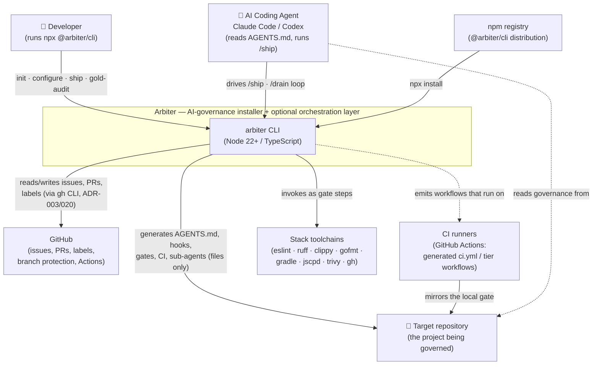
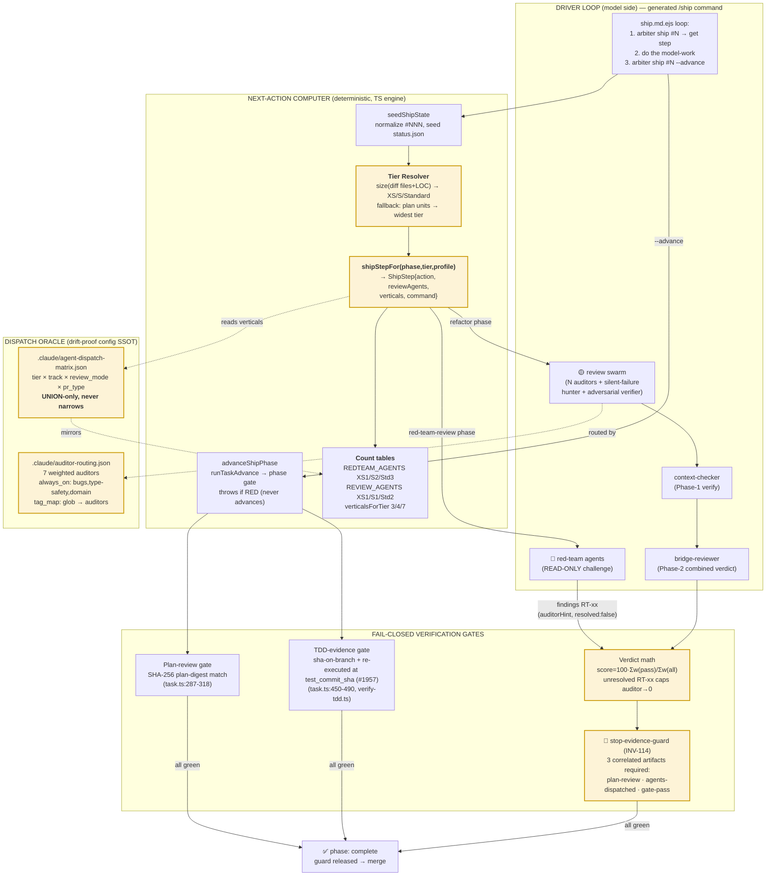

# Arbiter — C4 Model

A [C4](https://c4model.com/) view of arbiter at three zoom levels. Diagrams are
[Mermaid](https://mermaid.js.org/) (text, versionable). Level 3 (Component) zooms into the
**orchestration engine** — the crown jewel of the system and the reason this document exists.

> Reading order: **Context** (who arbiter serves) → **Container** (its internal subsystems) →
> **Component** (how the orchestration engine decides when to challenge, review, verify, and
> cluster). For the narrative and the runtime flows, see [`arc42.md`](arc42.md) §3, §5, §6.

---

## Level 1 — System Context

Arbiter is a **local, zero-telemetry CLI**. It makes zero unsolicited network calls; the only
network egress is the developer's own `gh`/`git`/`npm` invocations. It has **no server and no
database** — all state is ordinary version-controlled files plus a local `.arbiter/` scratch dir.



**Key context facts**

- **Two personas drive arbiter**: a human developer (occasional: `init`, `configure`,
  `gold-audit`) and an AI coding agent (continuous: the `/ship` and `/drain` loops). The agent is
  a first-class actor, not an afterthought — arbiter's contract is precisely that an agent
  "can't fake green".
- **Output is files, not a service.** Everything arbiter emits (`AGENTS.md`, `.claude/`,
  `scripts/check-all.mjs`, `.github/workflows/*`) is normal, version-controlled, deletable.
  Uninstall = `rm`.
- **`gh` is the only hard external dependency** for the GitHub-integration features (ADR-003);
  arbiter is CLI-first over MCP (ADR-020).
- **No telemetry, no network beacons** — enforced by `scripts/check-anti-telemetry.mjs` and a
  `telemetry-allowlist.json` suppression file.

---

## Level 2 — Container (subsystems inside arbiter)

Arbiter is a single Node process, but internally it is a set of cohesive subsystems. The
**installer core** (generation) and the **optional orchestration layer** (the `/ship`, `/drain`
engine) are distinct: the core is usable on its own; the orchestration layer sits on top.

```mermaid
graph TB
    cli["<b>CLI Front Controller</b><br/>src/cli.ts (commander)<br/>public via --help, full via help --all"]

    subgraph core["INSTALLER CORE (generation)"]
      wizard["<b>Wizard / Init</b><br/>src/wizard, src/commands/init<br/>interactive + non-interactive"]
      detect["<b>Detectors</b><br/>src/detectors<br/>language · framework · archetype"]
      profile["<b>Profile Resolver</b><br/>src/config (schema.ts,<br/>resolve-project-config.ts) ADR-094<br/>axes: level · archetype ·<br/>collab-mode · runner · contract"]
      gen["<b>Generators</b><br/>src/generators/*.ts<br/>render → writeFile per strategy"]
      tmpl["<b>Template Engine</b><br/>src/utils/render.ts (EJS)<br/>src/templates/**/*.ejs"]
      fs["<b>Write Pipeline</b><br/>src/utils/fs.ts<br/>backup · skipIfExists · deepMerge<br/>atomic tmp+rename"]
    end

    subgraph gov["GOVERNANCE MODEL (SSOT)"]
      inv["<b>Invariant Catalog</b><br/>src/invariants/catalog.ts<br/>INV-NN + selfOnly (ADR-059)"]
      kit["<b>KIT Catalog</b><br/>src/kit (catalog.json,<br/>taxonomy) ADR-045"]
      compat["<b>Compatibility Matrix</b><br/>src/compatibility<br/>language×archetype proven cells"]
    end

    subgraph verify["CHECK / VERIFY ENGINE"]
      conf["<b>Conformance Engine</b><br/>src/conformance (engine.ts,<br/>dimensions.ts) PASS/HALF/FAKE/FAIL"]
      gate["<b>Gate Runner</b><br/>scripts/check-all.mjs<br/>L1 ⊂ L2 ⊂ L3 ladder"]
      gold["<b>Gold Audit</b><br/>src/commands/gold-audit.ts<br/>scripts/gold-audit.mjs"]
      dog["<b>Self-Dogfood Check</b><br/>scripts/check-self-dogfood.mjs<br/>template↔materialized diff-pin"]
    end

    subgraph orch["ORCHESTRATION LAYER (optional) — the /ship, /drain engine"]
      ship["<b>Ship Engine</b><br/>src/commands/task-ship.ts<br/>next-action computer (ADR-088/093)"]
      state["<b>Task State Machine</b><br/>src/commands/task-state.ts<br/>10 phases, single-writer status.json"]
      vbridge["<b>Verification Bridge</b><br/>src/verify, verify-plan.ts<br/>rule engine → PASS/REJECT (ADR-039)"]
      fixred["<b>Fix-on-Red (policy)</b><br/>docs/REFERENCE/fix-on-red.md<br/>2-strike, fail-closed escalate — agent-reasoned"]
      gexec["<b>Gate Mutex</b><br/>src/commands/gate-exec.ts<br/>flock(1), keyed on git-common-dir"]
      wt["<b>Worktree Manager</b><br/>src/commands/worktree.ts<br/>src/worktree — isolation + harvest"]
    end

    subgraph audit["EVIDENCE & GRAPH"]
      ev["<b>Evidence Store</b><br/>src/evidence, .arbiter/evidence<br/>TDD · plan-review · redteam · gate"]
      graph["<b>Provenance Graph</b><br/>src/graph (ADR-040)<br/>enforces/proves edges"]
      plugin["<b>Plugin API</b><br/>src/types/plugin.ts, src/utils/plugin-loader.ts<br/>config-driven, no CLI subcommand (ADR-031/048)"]
    end

    cli --> wizard & ship & conf & gold & plugin
    wizard --> detect --> profile --> gen
    gen --> tmpl --> fs
    gen -.reads.-> inv & kit & compat
    ship --> state
    ship --> vbridge
    ship --> fixred
    ship --> wt
    wt --> gexec
    ship -.writes.-> ev
    vbridge -.reads/writes.-> ev
    conf -.reads.-> inv & kit
    gate --> conf
    gold --> conf
    dog -.diffs.-> tmpl
    graph -.feeds.-> vbridge

    classDef jewel fill:#fdf3d7,stroke:#c99700,stroke-width:2px;
    class ship,state,vbridge,fixred,gexec,wt jewel;
```

**Container responsibilities (one line each)**

| Container            | Responsibility                                                                                               |
| -------------------- | ------------------------------------------------------------------------------------------------------------ |
| CLI Front Controller | `commander` command surface; routes to command handlers; registers hidden/experimental commands              |
| Wizard / Init        | Interactive + flag-driven project bootstrap; produces a `ProjectConfig`                                      |
| Detectors            | Auto-detect language, framework/build tool, archetype from repo signals                                      |
| Profile Resolver     | Resolve one `ProjectProfile` from config across 5 orthogonal axes; single precedence layer (ADR-094)         |
| Generators           | Renders its templates and writes with the correct conflict strategy (count: `.bloat-baseline.json`)          |
| Template Engine      | EJS render; `governanceLevel` guards; static files copied verbatim (count: `.bloat-baseline.json`)           |
| Write Pipeline       | `backup` / `skipIfExists` / deep-merge strategies; atomic tmp+rename; SIG cleanup                            |
| Invariant Catalog    | Machine-readable INV-NN rules; `selfOnly` filters arbiter-internal rules from generated output               |
| KIT Catalog          | Dimension taxonomy (wrap-not-replace); links dims → invariants → validators                                  |
| Compatibility Matrix | `language × archetype` "proven" cells; every proven cell must be gated + fixtured (CANON-02/03)              |
| Conformance Engine   | Evaluate dimensions → `PASS / HALF / FAKE / FAIL` verdicts (ADR-083)                                         |
| Gate Runner          | `check-all.mjs` orchestrates the L1⊂L2⊂L3 check ladder                                                       |
| Gold Audit           | Score arbiter's own governance completeness (D-* dimensions) against a ratcheted baseline                    |
| Self-Dogfood Check   | Fail-closed diff between shipped templates and arbiter's materialized `.claude/`                             |
| Ship Engine          | Deterministic next-action computer; phase→step; advance-on-green                                             |
| Task State Machine   | 10-phase lifecycle; single-writer `status.json`; handoff/clear strategy                                      |
| Verification Bridge  | Plan-review rule engine; claim-verified gates (plan digest, TDD evidence, enforcement-weakening)             |
| Fix-on-Red           | Failure-signature 2-strike policy, agent-reasoned since T2 (no CLI engine); fail-closed `escalate-uncertain` |
| Gate Mutex           | `flock(1)` serialization of expensive gates across parallel worktrees of one repo                            |
| Worktree Manager     | Per-agent isolated worktrees; per-worktree caches; merge-guarded harvest                                     |
| Evidence Store       | Append-only TDD / plan-review / red-team / gate / companion artifacts under `.arbiter/`                      |
| Provenance Graph     | First-class `enforces` / `proves` edges linking invariants ↔ gates ↔ tests                                   |
| Plugin API           | Config-driven third-party rule plugins (`arbiter.json` `plugins[]`); no CLI subcommand (v1.1)                |

---

## Level 3 — Component: the Orchestration Engine (the jewel)

This is the heart of the system: **how arbiter decides when to challenge, how many reviewers to
dispatch, which review verticals fire, and how completion is gated on correlated evidence.**

The design principle is a **two-layer split**: arbiter's TypeScript engine is a _deterministic
next-action computer_ that **cannot write code or dispatch review sub-agents**; the generated
`/ship` slash command is the _model-driven driver loop_ that executes the model-requiring steps
between engine calls (`task-ship.ts:3-10`).



### The dynamic rules, precisely (with sources)

**1. Tier is auto-computed from issue SIZE, not chosen by a human, and NOT by model identity.**
`arbiter ship` computes the change size (files + LOC), falls back to the plan's unit estimate,
then to the widest tier (`Standard`) as a fail-safe (`ship.md.ejs:89`; `task-ship.ts:81-84`).
There is **no model-tier gating** anywhere in arbiter — the earlier model-selection machinery was
deliberately removed and is refused re-entry (`AGENTS.md` §Model-Pyramid; `task-ship.ts:86-90`).
The selected tier may be widened by two deterministic signals: a FRESH `graphify-out/graph.json`
blast-radius over the plan's `files:` manifest, or a `wave`/`epic` label or milestone bundle
(floor: Standard). Signals may only widen the tier, never narrow it. Tier/routing gates MUST NOT
be driven by text-only LLM classification of issue text (Study C, epic #2176: 75.6% adjacent
accuracy, 20% fail-dangerous L→S on 45 real issues).

**2. Four distinct count-axes all derive from tier — do not conflate them:**

| Axis                           | XS  | S   | Standard | Source                            |
| ------------------------------ | --- | --- | -------- | --------------------------------- |
| Red-team challenge agents      | 1   | 2   | 3        | `task-ship.ts:77`                 |
| Refactor-phase review agents   | 1   | 1   | 2        | `task-ship.ts:79`                 |
| `/review-code` reviewers       | 3   | 3   | 5        | `.claude/commands/review-code.md` |
| Review **verticals** (breadth) | 3   | 4   | 7        | `task-ship.ts:96-100`             |

Verticals widen with size: XS = `bugs, type-safety, domain`; S = `+test-quality`; Standard =
`+security, data-integrity, silent-failures`.

A file-path-matched security/data-integrity surface escalates refactor-phase review to 3 agents (#2178).

**3. Which verticals actually fire is resolved UNION-only, fail-safe toward MORE review.**
`agent-dispatch-matrix.json` resolves `tier × track × review_mode × pr_type` additively and never
narrows below the tier floor. `auditor-routing.json` maps changed-file globs → auditors
(`migrations/** → data-integrity+security`, `**/*.env* → security`), with an `always_on` floor of
`bugs, type-safety, domain` and `critical_paths` that force **all** auditors. A skip can never
raise the verdict score (no inflation by omission).

**4. The weighted verdict makes unresolved findings mathematically block PASS.**
`score = 100 × Σ(weight of passing active auditors) / Σ(weight of ALL active auditors)`; ladder
`≥80 PASS / ≥60 CONCERNS / ≥40 REWORK / <40 FAIL`. Every still-`resolved:false` red-team finding
caps its mapped auditor's score to 0 (`--caps`), so findings-resolution is _enforced arithmetic_,
not advice.

**5. Completion is fail-closed on three correlated artifacts (INV-114).**
The `stop-evidence-guard` hook blocks any completion claim until `plan-review/latest.json`,
`.arbiter/agents-dispatched.json`, and `.arbiter/gate-pass.json` all exist and correlate to the
current branch+SHA. "I reviewed it" without real agent tool-calls does not satisfy the gate
(`ship.md.ejs:230`).

**6. Governance level and collaboration mode gate the whole ceremony.**
At `governanceLevel === 'L1'` there is **no** red-team / multi-agent review phase at all. In
`trunk-solo` collaboration mode the review swarm collapses to _1 self-review agent + 1 adversarial
verifier_. Autonomy grants (`AUTONOMY_GRANTS`, `ship-profile.ts:153-165`) scale L0→L3 what the loop
may do unattended (auto-advance, auto-merge, fix-on-red, wave-batch, sub-agent auto-spawn) — but
floor invariants (2-strike, reproduce-before-push, no `--no-verify`, no commit-to-main) **cannot be
granted away**.

For the batch/wave sibling of this loop (`/drain`, issue clustering, worktree pool, gate mutex),
see [`arc42.md`](arc42.md) §6.3 (Runtime View — Wave Drain).
