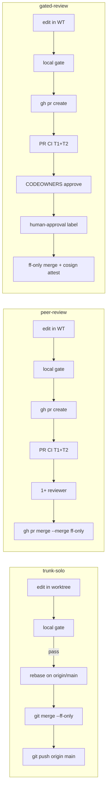
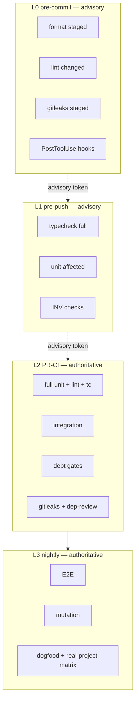

# Arbiter Workflow Model

> **Non-authoritative:** This page is compiled from source. On conflict, the SSOT source wins.
> Source: [docs/SYSTEM/WORKFLOW-MODEL.md](../docs/SYSTEM/WORKFLOW-MODEL.md)

# Arbiter Workflow Model

This document is the single-file synthesis of how arbiter's collaboration-mode axis
determines branching strategy, CI shape, and merge policy for scaffolded projects.

**ADR cross-references:** ADR-051 (collaboration-mode axis), ADR-050 (pipeline tiers).

---

## Collaboration Mode Axis

The primary driver for branching and CI shape is `collaborationMode`, not team size.
Team size is a friendly UX proxy in the wizard; the config stores `collaborationMode` only.

| `collaborationMode` | Trust model                    | Default branching | CI shape                 |
| ------------------- | ------------------------------ | ----------------- | ------------------------ |
| `trunk-solo`        | One author; signature = author | `trunk-direct`    | T1 + T4-lite nightly     |
| `peer-review`       | 1+ reviewers, shared trust     | `github-flow`     | T1 + T2 + T4 nightly     |
| `gated-review`      | CODEOWNERS + attestation chain | `github-flow`     | T1 + T2 + T4 + T5 weekly |

See ADR-051 for the full governance × collaboration coherence matrix (12 cells).

---

## Diagram 1 — Branching Flow per Collaboration Mode

---

## Diagram 2 — Check Ladder (Tiered)

CI does NOT trust the local token for skip decisions — it re-runs all checks.
The token is for local provenance/audit only (`arbiter doctor`).

---

## Pipeline Style Table

`(collaborationMode × governanceLevel) → pipelineStyle`

|        | trunk-solo | peer-review | gated-review |
| ------ | ---------- | ----------- | ------------ |
| **L1** | starter    | starter     | standard     |
| **L2** | starter    | standard    | standard     |
| **L3** | standard   | standard    | industrial   |
| **L4** | standard   | standard    | industrial   |

Source: `src/config/collaboration-mode-defaults.ts`.

---

## Migration FAQ

**Q: My project has `soloDevMode: true` in arbiter.json. What do I do?**

Run `arbiter update`. It detects `soloDevMode: true` and writes
`collaborationMode: 'trunk-solo'` automatically. The `soloDevMode` field remains
for one minor release, then will be removed.

**Q: Can I override the pipelineStyle independently of collaborationMode?**

Yes. Set `pipelineStyle` directly in `arbiter.json`. The generator uses explicit
`pipelineStyle` before consulting the collaborationMode table.

**Q: What is `branchingStrategy`?**

A derived field resolved by the generator — not set manually. It controls whether
EJS templates emit `develop`-branch triggers. Most projects use `github-flow`
(branches: `[main, "task/**"]`). Only opt-in gated-review projects use
`github-flow-with-develop`.

**Q: What happens if I set `L4 + trunk-solo`?**

The wizard rejects this combination with a remediation prompt. L4 requires
CODEOWNERS + human-approval attestation, which is incoherent with `direct` merge.
Switch to `peer-review` or downgrade to L3.
